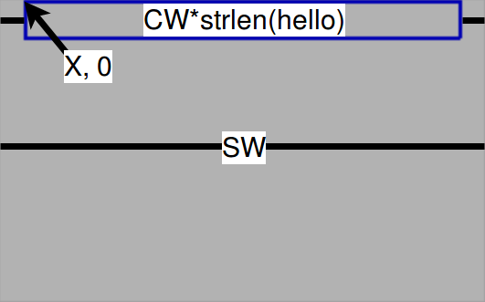
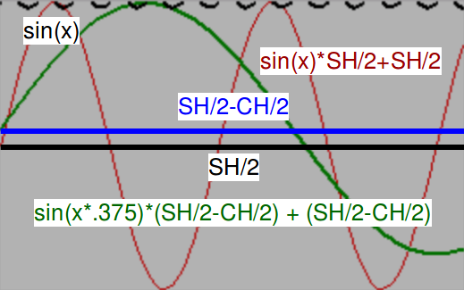
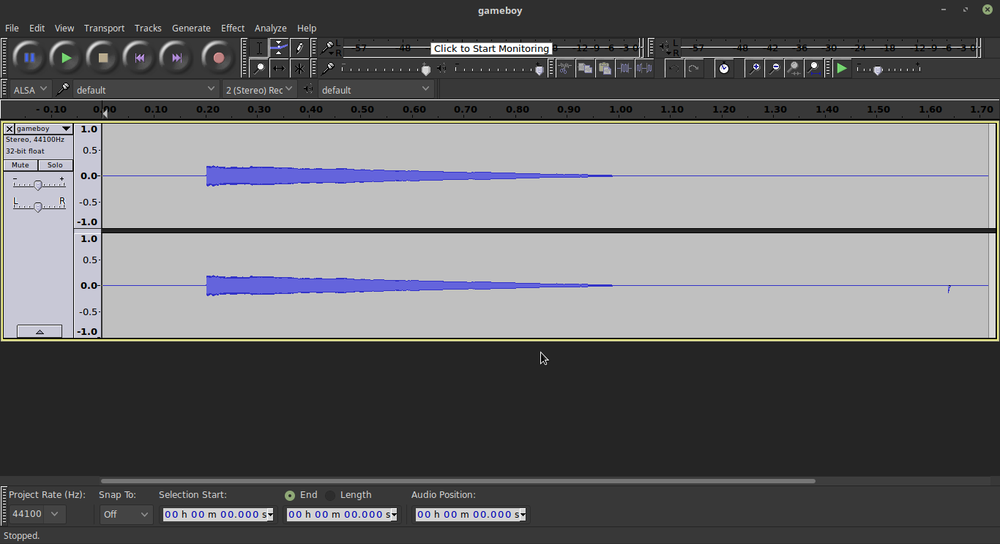
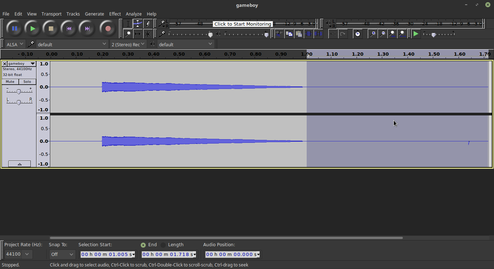
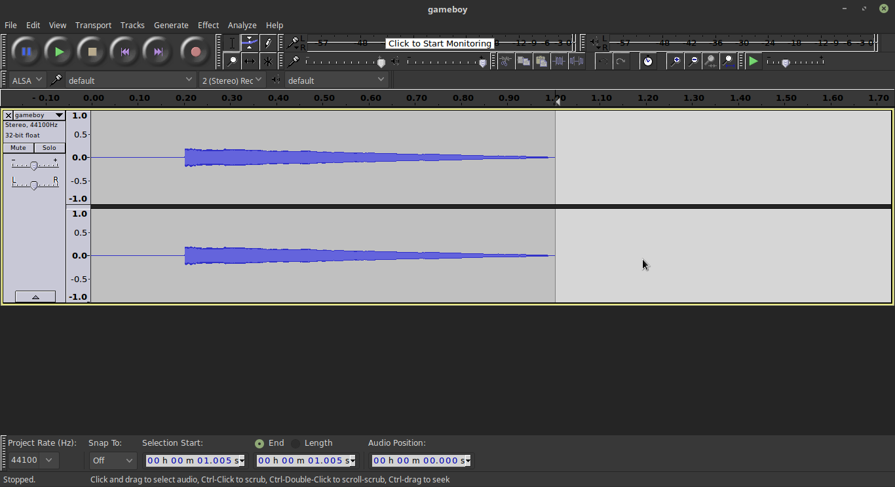
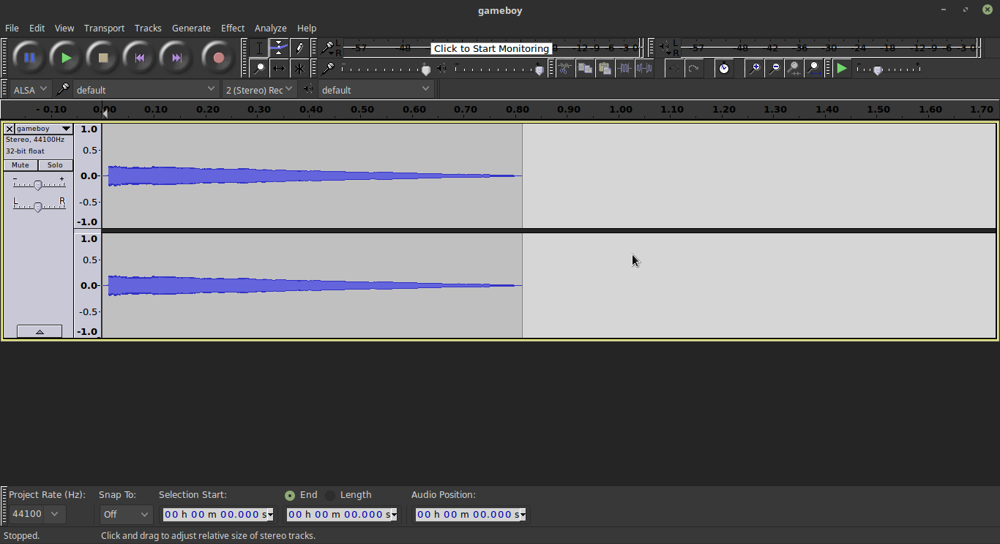
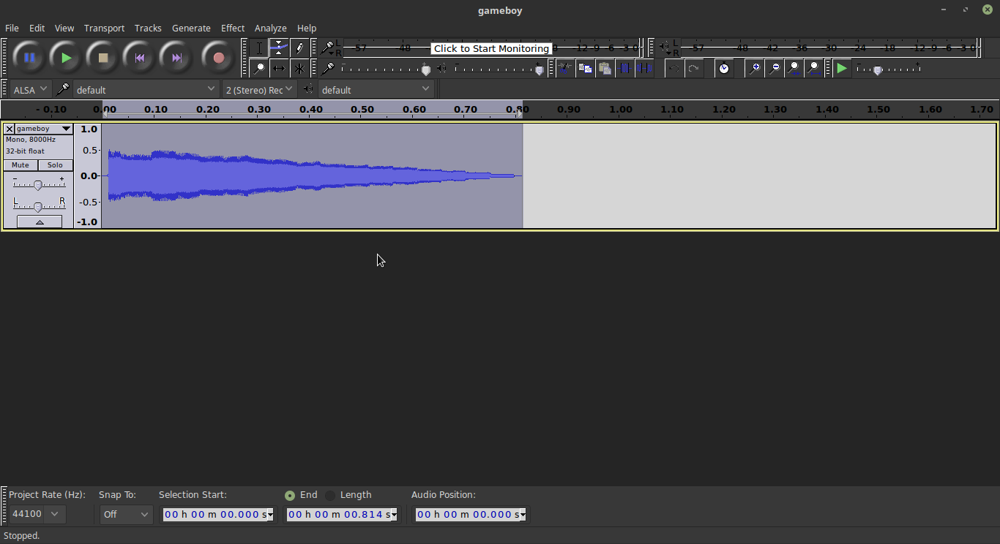
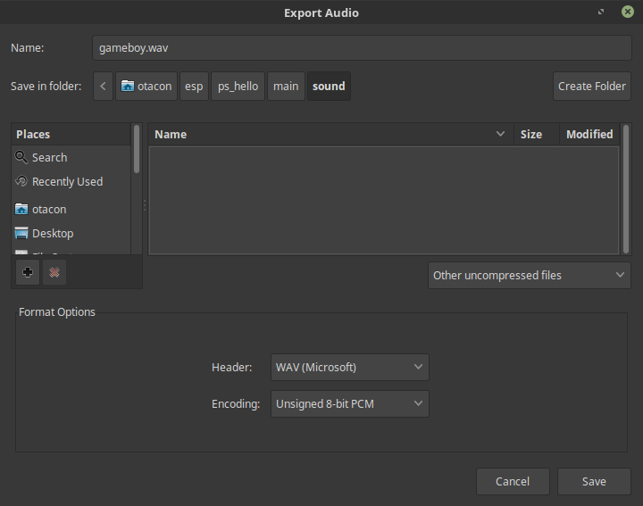
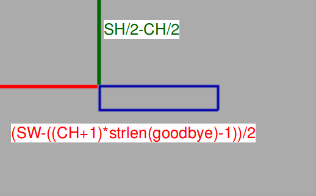

# PocketSprite Hello World Tutorial

Before jumping straight into the tutorial, I wanted to give a heads-up that this is my first time working with compiled C. Before this, I worked with the Arduino IDE and Python for the most part, so I'm not entirely used to working with environment variables and the `make` command all that much.

I should also note that any time there is a link within an explanation of a step, it's expected that you're looking at that page when I'm referring to that page. In other words, if you see the link, click it!

That being said, this was certainly quite the adventure, and many thanks go out to [Spritetm](https://github.com/Spritetm) and my close friend [mz2212](https://github.com/mz2212) for all of their support on me learning this project. Also, thanks to [ishotjr](https://github.com/ishotjr) for correcting many of my grammar mistakes. Without further ado, let's get started!

## Table of Contents

1. [Hit the Books - Reference Materials](#hit-the-books---reference-materials)
2. [A Dive Into C - Setting Up Your Environment](#a-dive-into-c---setting-up-your-environment)
3. [Say Hello - Running Your First Program](#say-hello---running-your-first-program)
4. [Actually Say Hello - Getting Text on the Screen](#actually-say-hello---getting-text-on-the-screen)
5. [Get Me Out! - Configuring the Power Button Menu](#get-me-out---configuring-the-power-button-menu)
6. [Make it Pretty - Centering the Text](#make-it-pretty---centering-the-text)
7. [Making Waves - Adding the sin() Function](#making-waves---adding-the-sin-function)
8. [:rainbow: Rainbows! :rainbow: - Adding Color](#rainbow-rainbows-rainbow---adding-color)
9. [Make Some Noise - Utilizing the sndmixer Library](#make-some-noise---utilizing-the-sndmixer-library)
10. [Saying Goodbye - Adding a Simple Exit Screen](#saying-goodbye---adding-a-simple-exit-screen)
11. [Final Thoughts](#final-thoughts)

## Hit the Books - Reference Materials

If you're going to be working with the PocketSprite, (I'll be referring to it as the PS from now on), you're going to be referencing *a lot* of documentation. Here are some of the documents and resources I found useful throughout the project:

* PS SDK’s documentation: http://pocketsprite-sdk.readthedocs.io/en/latest/
* PS Unofficial Discord: https://discord.gg/ZFka8Qa (You can find me there: \@Otacon#6446)
* PS Subreddit: https://reddit.com/r/PocketSprite/
* PS Github: https://github.com/PocketSprite
* µGUI Github: https://github.com/achimdoebler/UGUI
* µGUI Reference Guide: http://embeddedlightning.com/download/reference-guide/ ([mirror just in case](https://drive.google.com/open?id=18mFoiasivllBQAZpeXbYaeohxYOpiYLc))

And this isn't everything that I referenced for this simple little project. Undoubtedly, the most powerful resource, as any programmer will confirm, was my trusty Google search. I'll explain along the way where I struggled and how I came to my solutions.

## A Dive Into C - Setting Up Your Environment

I should mention now that I do all of my work on this device in Linux. Mint to be specific. In fact, the PS SDK mentions that only Linux is officially supported, for now. That being said, [rorosaurus](https://github.com/rorosaurus) has reported success with using the [Windows Subsystem for Linux](https://docs.microsoft.com/en-us/windows/wsl/install-win10) to install Ubuntu on Windows 10 and follow the Linux setup instructions normally. Let's proceed by following the linked guides in order.

The first thing mentioned in the Getting Started section of the [PS SDK documentation](http://pocketsprite-sdk.readthedocs.io/en/latest/gettingstarted/index.html#software) for software is that we need to [setup ESP-IDF](https://esp-idf.readthedocs.io/en/latest/get-started/index.html), which is the compiler for the ESP32; the microcontroller the PS runs on. This page looks daunting at first, but just scroll down until you find the nice large, friendly icons and click the Linux icon.

Follow the instructions step-by-step. *Slowly.* I had a lot of trouble here since it was my first go around with this, but just read everything on the page and follow each step carefully. Something I should mention briefly, although it will apply to few, I happen to use an alternative shell that's not `bash`, so I would occasionally run into weirdness. If you do that yourself, just save yourself the hassle and use `bash`.

Once you've followed the steps on the Toolchain Setup, follow the [Get ESP-IDF](https://esp-idf.readthedocs.io/en/latest/get-started/index.html#get-started-get-esp-idf) link. I recommend following the steps outlined in the `hello_world` project just to make sure everything compiles. However, you can skip the steps talking about enabling permissions for `/dev/tty0` and the parts about flashing since we're going to be uploading the files for our code via WiFi. You can simply do the following to test that creating the project folder worked:

```bash
cd ~/esp/hello_world
make
```

You should get an output similar to this:

```
LD build/hello-world.elf
esptool.py v2.3.1
To flash all build output, run 'make flash' or:
python /home/otacon/esp/esp-idf/components/esptool_py/esptool/esptool.py --chip esp32 --port /dev/ttyUSB0 --baud 115200 --before default_reset --after hard_reset write_flash -z --flash_mode dio --flash_freq 40m --flash_size detect 0x1000 /home/otacon/esp/hello_world/build/bootloader/bootloader.bin 0x10000 /home/otacon/esp/hello_world/build/hello-world.bin 0x8000 /home/otacon/esp/hello_world/build/partitions_singleapp.bin
```

You can safely delete the `hello_world` folder once you're done since we won't be using it. Once that's done, it's time to...

### Set Up the PocketSprite Environment

Similarly, just slowly follow the steps provided in the [PS SDK Getting Started](http://pocketsprite-sdk.readthedocs.io/en/latest/gettingstarted/index.html#software) page. Once you have your environment variables setup and ready to go, it's time to get started on our actual program!

## Say Hello - Running Your First Program

The absolute minimum required for getting your project started is the following:

* Create an empty folder with the name `ps_hello`
* Create a new file `makefile` in this folder
* Add the following code in this file:
```make
EXTRA_COMPONENT_DIRS := $(POCKETSPRITE_PATH)/8bkc-components/
IDF_PATH := $(POCKETSPRITE_PATH)/esp-idf

PROJECT_NAME := ps_hello

include $(IDF_PATH)/make/project.mk
```
* Create a folder inside this one called `main`
* Create a new file in the `main` folder called `main.c`
* Add the following to the `main.c` file:
```C
void app_main() {
}
```
* Create an empty file called `component.mk` also in the `main` folder - *We'll learn what this file does much later*
* In your terminal, run `cd ~/esp/ps_hello`
* Run `make menuconfig` and choose the following options:
    * Compiler Options --> Optimization Level --> Select "Release"
	* Component Config --> SPI Flash driver --> Writing to Dangerous Regions --> Select "Allowed"
* Choose Exit until the menu closes
* Run `make`

The first time you run this, it can take some time. If you want to speed up the process, you can use `make -j X` with X being the number of cores/threads your computer has available.

This step will create a new directory, `build`, which contain all of the compiled code. Since we don't have anything in our app yet, we don't need to worry about the files there just yet. We'll come back to that in a moment.

In order to make the simplest compiled app, we can open up our `main.c` file and replace the existing code:

```C
#include "8bkc-hal.h" // PS HW Abstraction Layer

void app_main() {
  kchal_init(); // Initialize the PocketSprite SDK.
  kchal_exit_to_chooser(); // Exit the application
}
```

I'll give you three guesses as to what this program does, but chances are, you only need one. This will simply exit the application silently and bring you back to the WiFi connection screen. Nothing too exciting, but it will prove that we can make an app.

Next, we'll need to get this code running on the device. You can simply run `make` agin. Now that we have some code to work with, let's get it on the PocketSprite.

If you haven't already figured out how to upload files to the device, it's fairly simple. Power on the device and leave it on the
```
WiFi AP
 pkspr
GO TO:
HTTP://192.
168.4.1/
```
screen. Then, connect your computer to that WiFi access point. There will be no internet connection unless you also have an ethernet connection. Once connected, open the http://192.168.4.1 URL the browser of your choice and click the "Upload!" button. Then navigate to the `build` folder and choose our `ps_hello.bin`. Once uploaded, press any button on the PS and choose `ps_hello` from the list.

Technically you can change this file to the .app extension if you want, but the device recognizes the .bin extension without any issue, so I personally just use the .bin.

If we did everything right, when you select the `ps_hello` app, it should pause for just a brief moment, then return to the same WiFi screen we saw earlier. Success! (unless not, in which case, good luck and use your [resources](#hitthebooks)!)

From this point forward, any time we have code that *should* run, I'll put a **Code Checkpoint** link at the end of a section for comparison. Whenever you see the **Code Checkpoint** link, also assume that you can compile the code and upload to the device and it should work.

This is the first one and the rest of them will also look like this:

### **[Code Checkpoint 1](code/main1.c)**

*Note: If at any point, you find that my full code does not work, you can reach out to me on [the Discord channel](https://discord.gg/ZFka8Qa), as mentioned above.*

## Actually Say Hello - Getting Text on the Screen

Now that we have a base for our program, let's get started with getting some text on the screen.

We'll need to bring in a few new libraries for this. Add the following lines next to our other `#include` statement:

```C
#include "8bkc-ugui.h" // PS uGUI
#include "ugui.h" // Full uGUI library - Full uGUI reference guide: http://embeddedlightning.com/download/reference-guide/
```

Add this to the `app_main()` function:

```C
kcugui_init(); // Initialize uGUI
UG_FontSelect(&FONT_6X8); // The default font that is enabled out of the box
UG_SetForecolor(C_WHITE); // You can find a full list of colors in the µGUI Reference Guide
UG_SetBackcolor(C_BLACK);

kcugui_cls(); // Clear the display
UG_PutString(0, 0, "Hello World!"); // UG S16 x , UG S16 y , char* str
kcugui_flush(); // Send buffer to display
```

You can remove the `kchal_exit_to_chooser();` line we added earlier for now. Otherwise, it won't stay on the screen for very long.

### **[Code Checkpoint 2](code/main2.c)**

The important thing to note here is that we didn't give ourselves a way to exit the app. None of the buttons will respond and it appears we're stuck. At any point (no matter how stuck it appears), you can press the Start and Power buttons at the same time to force a reboot. This will come in quite handy while we're writing for the PS and something goes wrong. I speak from experience when I say that it will happen often.

At this point, you should be able to see just the text "Hello World!" on the display. Since the display is so small, the '!' gets put on the next line.

## Get Me Out! - Configuring the Power Button Menu

Time to include another library. Add the following line where the other libraries are:

```C
#include "powerbtn_menu.h" // Power Button menu stuff powerbtn_menu_show, constants, etc
```

Then add the following above `app_main()`:

```C
static void do_powerbtn_menu() {
    int pwr_input = powerbtn_menu_show(kcugui_get_fb()); // Call the powerbutton menu

    if (pwr_input == POWERBTN_MENU_EXIT) { // This handles the input from the power button menu - without it, menu options do nothing
        kchal_exit_to_chooser();
    } else if (pwr_input == POWERBTN_MENU_POWERDOWN) {
        kchal_power_down();
    }
}
```

Okay. What did we just add? First off, the line `int pwr_input = powerbtn_menu_show(kcugui_get_fb());` calls the power button menu from `powerbtn_menu.h` and since the function outputs to an `int` type variable, we need to store that output to something. In this case, the variable `pwr_input` that we initialized.

Now that `pwr_input` has a value, we need to do something with it, so we check if the user selected the Close App option or the Power Down option. Depending on their input, we then run the associated commands. Normally, I'd include a link to the documentation here to explain the values we get back, but it appears it hasn't been written yet. I will update this tutorial as soon as it is made public.

We then need to add a section to the bottom of `app_main()` to tell it to check the hardware buttons for any input:

```C
while (true) {
    if (kchal_get_keys() & KC_BTN_POWER) { // Check for power button press
        do_powerbtn_menu();
    }
}
```

Don't be tempted to remove the braces to shorten things. We'll be adding more here later on.

### **[Code Checkpoint 3](code/main3.c)**

Now when you press the power button, you should see the menu that shows for the built-in emulators, including the brightness and volume controls.

## Make it Pretty - Centering the Text

If you're not a fan of math, this next section is not going to be the easiest to read, but I've done my best to explain how everything works. If we want to replicate what I've done in the video where the text moves along a sine wave, we'll need to make some significant changes to how the text is being drawn first.

Let's add the following:

```C
#include "string.h" // Needed for str_len()
```

We first need to split our "Hello World" string into multiple parts and make it into a variable we can use. We'll be taking out the

```C
kcugui_cls(); // Clear the display
UG_PutString(0, 0, "Hello World!");
kcugui_flush(); // Send buffer to display
```

lines for now. Let's start by creating the string using the following line right underneath our `#include` lines:

```C
char hello[] = "Hello World!"; // Store string that will be used
```

This will make the `"Hello World!"` string into an array of characters that we can iterate through in a loop so that each of them can get unique X and Y values.

Before we get into anything too complex, let's define some values to make our lives easier later on, under the `hello[]` variable:

```C
const UG_FONT *font = &FONT_6X8; // Define font for more readable code

#define SW KC_SCREEN_W // Screen width
#define SH KC_SCREEN_H // Screen height
#define CW font->char_width // Character width
#define CH font->char_height // Character height
```

Let's also swap out the `UG_FontSelect(&FONT_6X8);` line for `UG_FontSelect(font);` now that we have that as a variable.

Now that we have some easier values to work with, let's restore the functionality we started with by mimicking the `UG_PutString()` function. Add the following lines to the `while()` loop:

```C
kcugui_cls(); // Clear the display
for (int i = 0; i < strlen(hello); i++) {
	UG_PutChar(hello[i], // Char
		i * CW, // X
		0, // Y
		C_WHITE, // Foreground Color
		C_BLACK); // Background Color
}
kcugui_flush(); // Push the buffer to the display
```

It will look a bit odd this early on to put these on separate lines, but as these values become more complex, it will be very useful having them split up like this.

If you run the code at this point, you should have almost the same result as before, except that the text is a bit more condensed since the `UG_PutString()` command adds an extra pixel of space in between each letter, which isn't necessary with this font. So it now fits on one line. Before we compile again, though, let's center the text. This is where the math comes in. See the below picture:



We're trying to get the value of `X` here. We figure out the width of the text by taking the length of the string and multiplying it by the number of characters in the string with `CW*strlen(hello)`.

Next, we need to figure out to total of the blank space left over by subtracting that from `SW` so we get `SW-CW*strlen(hello)`. Then we just need to get half of that value: `(SW-CW*strlen(hello))/2`, and add that offset to each character.

Your `UG_PutChar` function should look like this now:
```C
UG_PutChar(hello[i], // Char
	i * CW + (SW - strlen(hello) * CW) / 2, // X
	0, // Y
	C_WHITE, // Foreground Color
	C_BLACK); // Background Color
```

It's been a while since we've compiled, so let's make sure all of those changes work.

### **[Code Checkpoint 4](code/main4.c)**

## Making Waves - Adding the sin() Function

The math only gets harder from here. Time for more libraries. Add the following line to our already existing `#include` lines:

```C
#include "math.h" // Needed for fabs(), fmod(), sin()
```

It's important to understand some basics of the `sin()` function. If we plot `Y=sin(x)` on a calculator with the window adjusted to the screen resolution of the PocketSprite, we get the black line in this picture:



This black line goes from the value -1 to +1. What we want is for the value to go from 0 to the height of the screen (SH). In order to do that, we want to take that line and push it to the middle of the screen and make it the height of the screen. We can do that by adding half the height of the screen and multiplying it by half the height of the screen with `Y=sin(x)*SH/2 + SH/2`. That gives us the red line. As we know, the `UG_PutChar()` function starts at the top-left of the character, so we actually need to offset the sine wave. Again, the math is a bit tricky.

*Note: I've adjusted the red and green line by multiplying by the width of the characters (CW). These lines show where the characters would end up along these lines.*

We need to shrink the sine wave by the height of a full character, the move it back up by half the height of a full character, making the center the blue line. The resulting line is green. I've also multiplied `X` by less than one to make the sine wave have a lower frequency. This just makes it look cleaner on the small display. So now we have `Y=sin(x*.375)*(SH/2-CH/2)-(SH/2-CH/2)`.

If we want to apply this to our text, we just need to multiply our sine wave by the index of the characters themselves. And to gain better control of that `.375`, we just need to add a new `#define` with the others:

```C
#define SIN_FREQ 0.375 // Multiplier for the sine wave density: smaller = larger wave
```

Then we just swap out the existing Y line for this:

```C
round(sin(i * SIN_FREQ) * (SH/2 - CH/2) + (SH/2 - CH/2)), // Y
````

We place it within a `round()` since we're working with pixels and we can't put anything on a half-pixel. The only thing left is to move the sine wave over time. For that, we'll create a `phase` variable outside our `app_main()` with the line

```C
float phase = 0; // This will be used for the sine wave animation
```

Then, within the `while()` loop, we want to move the phase by 1 degree. I'm not going into detail on the math for this one, but just know that this equates to +1 degree per frame. ;)

```C
phase = fmod(phase + 1 / (2 * M_PI), 2*M_PI);
```

If you find this to be a bit slow or fast, you can create a new variable, such as `SIN_DEG` by defining it next to the other defines with

```C
#define SIN_DEG 1 // Number of degrees per frame the phase for the sine wave moves
```

Then multiply it like so:

```C
phase = fmod(phase + 1 / (2 * M_PI) * SIN_DEG, 2*M_PI); // Move phase forward by SIN_DEG degrees per frame
```

Let's not forget to make use of our new variable. Adjust the `// Y` line to read as such:

```C
round(sin(i * SIN_FREQ + phase) * (SH / 2 - CH / 2) + (SH / 2 - CH / 2)), // Y
```

Then, just change the `#define SIN_DEG 1` to whatever multiplier you'd like. Higher numbers mean faster sine waves.

We just made some *major* modifications to our code. Time to make sure it all works.

### **[Code Checkpoint 5](code/main5.c)**

## :rainbow: Rainbows! :rainbow: - Adding Color

I won't even bother trying to explain how to convert from Hue, Saturation and Value to Red, Green and Blue since that could be its own tutorial. Instead, I wrote a simple header file that you can import.

You'll need to download the [header file](../main/hsv2rgb.h) and [C file](../main/hsv2rgb.c) and place them in the `main` folder. This handles the conversion from Hue, Saturation, Value to Red, Green, Blue. If you're feeling adventurous, you can read about it [here](https://www.rapidtables.com/convert/color/hsv-to-rgb.html).

You can import this library just like any of the others:

```C
#include "hsv2rgb.h" // Header I created for converting HSV to RGB
```

Next, we'll need to create a variable for the color phase right next to the `phase` variable:

```C
float color_phase = 0; // This will be used for rotating the base hue for the text
```

Now we just need to define a new variable type call HSV. This is why we needed to import that header. Don't worry about this too much in early projects, but learning how to create new variable types is essential when working with limited hardware like this and for programming in general.

I recommend, for readability, putting all of this right above your `UG_PutChar()` function. You'll notice we're also using another variable type `RGB`:

```C
HSV hsv;
hsv.hue = fmod(color_phase + i, 360);
hsv.sat = 1;
hsv.val = 1;
RGB rgb = hsv2rgb(hsv);
```

By default, this will make all of the colors almost the same since we're only moving the hue of the color by 1 degree per character. To make it more noticable, we can add a new `#define` with the others. I recommend somewhere around 10 to 30 degrees per character:

```C
#define COL_OFFSET 10 // Number of degrees per character the base hue is offset by
```

Then modify the `hsv.hue` line to:

```C
hsv.hue = fmod(color_phase + i*COL_OFFSET, 360);
```

Just like the sine wave, we need to update it per frame. Add the following line right next to your `phase` line:

```C
color_phase = fmod(color_phase + 1, 360.0f);
```

If you want to, we can define yet another new value to control how fast the colors move:

```C
#define COL_DEG 2 // Number of degrees the base hue moves per frame
```

And modify our `color_phase` line:

```C
color_phase = fmod(color_phase + COL_DEG, 360.0f); // Move the base hue by COL_DEG per frame
```

Then we just need to modify the `C_WHITE` line to read:

```C
kchal_ugui_rgb(rgb.r, rgb.g, rgb.b), // Foreground Color
```

And that's all it takes to add a nice rainbow effect to our text.

### **[Code Checkpoint 6](code/main6.c)**

## Make Some Noise - Utilizing the sndmixer Library

Time for us to make use of that built-in speaker. Some important information about the speaker and some challenges I faced. First off, it's important to know that the PS processes audio best when it's an 8-bit audio file with a mono channel. It can technically handle a high sample rate, but since we're using such a small speaker and trying to save on space, I found myself processing the audio at 8 khz.

It can be a bit of a challenge making sure the audio meets those requirements. If you don't need this or don't want to do this yourself, you can skip to the [Adding Our Code](#adding-our-code) section and just use [this file](sound/gameboy.wav).

If you want to do it yourself, read on!

#### Converting the audio

I personally used [Audacity](https://www.audacityteam.org/) for this since it's free and fairly simple to do what we're doing in it. To start, open any file that you want to convert. In this example, I used the GameBoy startup sound. I recommend a short sound so that it doesn't take up much space. It doesn't matter too much if you choose to make a copy or read files directly in this case.

You'll be presented with the following screen:



First, we'll want to trim off the extra silence at the beginning and end. You can do this by selecting a section like text, then just pressing the Delete key:







Next, adjust the sample rate by choosing `Tracks > Resample...` and resample it to 8000 Hz. To make it a Mono track, choose `Tracks > Stereo to Mono`. Set the `Project Sample Rate` at the bottom-left to 8000 Hz.

To make sure that we don't cause any potential damage to the speaker (even though it is unlikely), choose `Effect > Amplify...` and enter `-6` for the `New Peak Amplitude` and choose `OK`.



Finally, we can export it. Choose `File > Export Audio`. For filetype, choose "Other uncompressed formats". Set the header to WAV, encoding to Unsigned 8-Bit PCM. Make sure to change the file extension to `.wav`.



Keeping the file name short will save you some hassle later on, so keep that in mind.

#### Adding our code

Again, we'll need to add another library:

```C
#include "sndmixer.h"		 // Sound Mixer library
```

Then initialize the library by adding the following line along with the other `init()` functions:

```C
sndmixer_init(1, 8000); // (no. of channels, sample rate in khz)
```

Now we need to do something a bit different. We need to tell the compiler to convert our audio file into a binary file that the sndmixer library can use. In the `component.mk` file we created early on, we'll tell it to look at the .wav file we just made by adding the following line of code:

```mk
COMPONENT_EMBED_FILES := sound/gameboy.wav # The wave files get embedded as binary files.
```

Next time we compile the app, it will create the binary files for us. Now we need to go back to our `main.c` and define a few special variables outside the `app_main()`:

```C
extern const uint8_t gameboy_wav_start[] asm("_binary_gameboy_wav_start"); // Utilize generated binary pointers
extern const uint8_t gameboy_wav_end[] asm("_binary_gameboy_wav_end");
```

I won't get into detail on what this does, since I loosely understand it myself at best. But from what I gather, it's telling the sndmixer library where the binary data for these files within the binary blob exists.

Now we'll create a simple function that plays the sound whenever we call it. Make sure to put this outside the `app_main()` function:

```C
void play_sound() {
	int id = sndmixer_queue_wav(gameboy_wav_start, gameboy_wav_end, 0);
	sndmixer_play(id);
}
```

This will give the `sndmixer_play()` function the information on all of that binary data that was created and generate a simple id number that it can refer to. Again, I only have a loose understanding of this particular concept, so this is about as thorough of an explanation I can provide.

If we want to copy the functionality of my example completely, we'll make it play the noise only when we press the `A` button.

Within the `while()` loop, let's add an `else if` to the power button check that also looks for the `A` button:

```C
if (kchal_get_keys() & KC_BTN_POWER) { // Check for power button press
	do_powerbtn_menu();
} else if (kchal_get_keys() & KC_BTN_A) { // Check for A button press
	play_sound();
}
```

And if you compile it, you should now have the ability to get those classic GameBoy feels (or whatever sound you decided to use).

### **[Code Checkpoint 7](code/main7.c)**

## Saying Goodbye - Adding a Simple Exit Screen

For a final touch of personality, let's add a simple "Goodbye!" message that shows as you power down or exit the device. It sounds simple, but we'll actually need to pull in our last libraries and create a new function, as well as do some more math. Thankfully we did almost this exact math earlier, so we'll only be making a few minor changes.

We'll need to grab the following libraries in order to utilize the FreeRTOS sleep functionality.

```C
#include "freertos/FreeRTOS.h" // These libraries are required for the vTaskDelay function
#include "freertos/task.h"
```

Because we'll need to use it as a variable, add this right underneath the `char hello[]` line:

```C
char goodbye[] = "Goodbye!";
```

Next we'll create the following function. Make sure to add this outside `app_main()`:

```C
void exit_anim() { // What to show when exiting
	kcugui_cls();
	UG_PutString(0, 0, goodbye);
	kcugui_flush();
}
```

Now to center the text.



`Y` is simple. We just need to take half the screen height and subtract half the character height.

`X`, not so much. We'll need to take width of the screen and subtract the width of the text. So we need the `CW` times the number of characters. Then we need to add 1 for each character since the `UG_PutString` command adds an extra pixel in between each character, then take away the extra pixel for the last character. Then we divide the whole thing by 2. Your resulting function should look like this:

```C
UG_PutString((SW-((CW + 1)*strlen(goodbye)-1))/2, (SH-CH)/2, goodbye);
```

Not the easiest thing to read, but I've triple-checked to make sure it puts the text at exact center.

Then, right after the `kcugui_flush();`, we want it to pause on the message for a bit. We can do that by adding the following line:

```C
vTaskDelay(pdMS_TO_TICKS(2000)); // PS version of sleep(ms)
```

This hooks into the real-time clock and pauses for two seconds before continuing. Lastly, we want to make use of the function we just created. All we have to do is add our new `exit_anim()` function on the line just below `int pwr_input = powerbtn_menu_show(kcugui_get_fb());` line.

And now we have completely replicated the entire app!

### **[Code Checkpoint 8](code/main8.c)**

## Final Thoughts

If you managed to make it this far (and your code actually works), congratulations! This was certainly one of the most challenging projects I've worked on and an even more challenging tutorial. After all, what use is learning if you can't apply it!

If you have any questions on anything in the tutorial, feel free to reach out to me on the Discord channel and I will do my best to help.

With all of that said, this was an excellent learning experience and I look forward to learning much more with this device as time goes on.

### Coding Challenges

If you're still itching for more, why not try something on your own? Here are just some ideas I came up with. If you happen to meet any of these challenges successfully, I will feature them here with a link to your code on GitHub.

* Turn the rainbow wave into a function and have it display a random message in a text file uploaded to the device
	* For an added challenge, if the message is longer than the display, make it scroll!
* Change the `#define` lines to variables and allow the user to change them on the fly with a `Start` menu
* Make the device show something special or play a special sound when you enter the Konami code
* Have the device play .mod sound files instead of .wav and let the user cycle through songs with the press of a button.
